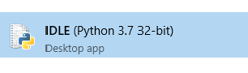

# Урок 1

Язык **Python** - это универсальный язык, пригодный для создания как текстовых процессоров, так до веб-браузеров.

Вот несколько причин изучить питон:

1. **Python** легок в изучении и применении.
2. В **Python** есть множество библиотек готовых функций и процедур для использования в своих программах
3. **Python** подходит для создания серьезных программ. Его даже используют в Google, NASA и на студии Pixar

### Установка Python

Для установки **Python** достаточно зайти на [сайт загрузки](https://www.python.org/downloads/ "Выбор версии Python") и скачать самую последнюю версию **Python** подходящей для вашей 
операционной системы и запустить установку.

### Запуск Python

После того как программа установится, можно запускать среду разработки **Python** - ___IDLE___:



В **IDLE** уже можно выполнять простые команды, например печать  например:

```python
1+1 # Напечатает 2
```

### Написание программ в Python

Для написания нашей первой программы в языке **Python** необходимо кликнуть на меню **File** и выбрать ___New Window___. После чего откроется окно программы.
Введем нашую первую программу - команду для печати слов Hello World!:

```python
print('Hello world!')
```

По нажатию **F5** Python предложит сохранить программу(все программы не получится запустить не сохранив)
Результат отобразится в окне консоли:

```python
>>>
Hello World!
>>>
```

## Ошибки

Бывает, что программа сначала не запускается, но это всегда можно исправить. Python отображает сообщение об ошибке с информацией о том, в чем может быть проблема, а также подсвечивает место или указывает строку прямо в консоли, где встретилась это ошибка:

 

Если не получается разобраться в чем ошибка, монжо следовать следующему алгоритму их поиска:

- [x] Проверь код программы на опечатки
- [x] Если программа что то печатает, заключены ли сообщения в одинарные кавычки?
- [x] Нет ли в начале строки лишних пробелов? Отступы очень важны в **Python**
- [x] Все ли в порядке в строках сразу перед и после выделенной строки с ошибкой? Бывает, что проблема там.
- [x] Проверял ли твой код кто-то еще? Порой другой человек может заметить свежим взглядом упущенную ошибку.

### Игра "Дом с привидениями"

Попробуем написать несложную игру, чтобы разборать моменты, на которые стоит обращать внимание при программировании на **Python**. Все что написано после знаков ```#``` перепечатывать не надо. Это комментарии, помогающие понять смысл программы. ведем код программы и запустим её:

```python
# Ghost Game
from random import randint
print('Ghost game')  # Одинарные кавычки!
feeling_Brave = True 
score = 0
while feeling_Brave: # Двоеточие 
    ghost_door = randint(1,3)   # Начиная с этой строки должен быть отступ в 4 пробела
    print('Three doors ahead.') # Если отступ не появился, проверь, стоит ли после feeling_Brave двоеточие
    print('A ghost behind one.')
    print('Which door do you open?')
    door = input('1,2 or 3?')
    door_num = int(door)
    if door_num == ghost_door: # Здесь должно быть 2 знака равенства
        print('GHOST!')
        feeling_Brave = False
    else:	# При вводе текста тут будет отступ в 8 пробелов и его надо будет уменьшить до 4 пробелов
        print('No ghost!')
        print('You enter the next room.')
        score = score +1
print('Run away!')   # А здесь отступ необходимо убрать
print('Game over! you scored ', score)

```

1. После того, как мы набрали текст программы, открой меню Run и выбери Run Module. Перед этим программу нужно сохранить.
2. Игра начнется в окне консоли. ```"За одной из трех дверей скрывается привидение. Каждую дверь ты выберешь? Напечатай 1,2 или 3 и нажми Enter."```
3. Задача в игре - выбрать дверь, за которой не привидения. Угадав, ты перейдешь в следующую комнату, где игра продолжится.
4. Если нам не повезло и за дверью прячется привидения, игра закончится. Запусти программу еще раз - сумеешь ли ты превзойти свой прошлый результат?

### Разбор игры

1. ###### Подготовка к игре:
   Эти команды выполнятся только один раз - в начале программы. Они печатают название игры, настраивают переменные и команду randint

   ```python
   #Ghost Game
   from random import randint # Настраивает команду randint, которая генерирует случайные числа
   print('Ghost game') # Команда print печатает текст в игре
   feeling_Brave = True 
   score = 0 # сбрасывает счет игры в 0
   ```

2. ###### Основной цикл и ветвление:
   В этом цикле печатаются правила игры и запрашивается ответ игрока. Пока игрок не столкнулся с привидением, цикл продолжается. Если же  за дверью привидение, переменная feeling_Brave принимает значение False(Ложь) и цикл продолжается. В ветвлении программа выполняет разные действия в зависимости от того, есть ли за выбранной двеьрю привидение. Если игрок встретил привидение, то переменная feeling_Brave принимает значение False, а если нет, счет игры увеличивается на единиицу.

   ```python
   while feeling_Brave:  #Начало цикла
       ghost_door = randint(1,3)   # Выбираем случайное число от 1 до 3
       print('Three doors ahead.') # Печатаем текст на экране при помощи команды print
       print('A ghost behind one.')
       print('Which door do you open?')
       door = input('1,2 or 3?') # Запрашивает выбор игрока и сохраняет его в переменную door
       door_num = int(door)
       if door_num == ghost_door: # Начало ветвления. 
           print('GHOST!') # Эта часть цикла выполняется, если за выбранной дверью есть привидение
           feeling_Brave = False
       else:	
           print('No ghost!') # Если призрака нет, то игрок увидит это сообщение и игра продолжится
           print('You enter the next room.')
           score = score + 1 # Увеличивается количество очков, если игрок не встретил привидения
   ```

3. ###### Конец игры:

   Эта часть программы выполняется только один раз, когда игрок встретит привидение. Благодаря отсутствию отступов Python знает, что эти команды вне цикла.
   ```python
   print('Run away!')   # Сообщаем что игрок убежал
   print('Game over! you scored ', score) # Счет игры это переменная score, значение которой меняется в зависимости от количества пройденных комнат
   ```

