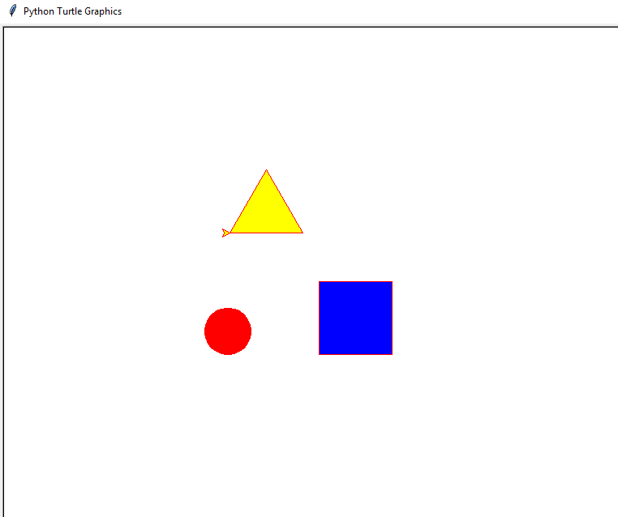

## Практика с функциями

Попробуем улучшить код, написанный нами на одном из прошлых уроков, где мы рисовали фигуры.

```python
from turtle import *

#Рисует квадрат. 
for i in range(4):
    left(90)
    forward(100)
    
forward(100)

#Рисует круг.
for i in range(36):
    forward(10)
    right(10)

forward(100)

#Рисует треугольник
for i in range(3):
    forward(100)
    left(120)
```


Попробуем его расширить используя имеющиеся у нас теперь знания: Избавимся от лишних линий, добавим цвет, разведем код по отдельным функциям и воспользуемся несколькими способами передачи значений. В этом нам помогут следующии функции, уже имеющиеся в библиотеке turtle:

```python
color('red','red')#цвет ручки и цвет закрашивания соответственно
pendown()# опустить ручку
penup()# поднять ручку
begin_fill()# начать закрашивание
end_fill()# закончить закрашивание
```

В результате у нас должно получиться что то следующее:

```python
from turtle import *

step=5
start_color = 'red'
def draw_square(val):
    begin_fill()
    pendown()
    color(start_color,'blue')
    for i in range(4):
        left(90)
        forward(val)
    end_fill()
    penup()

def draw_round():
    begin_fill()
    pendown()
    color(start_color)#глобальная переменная start_color, красный цвет
    for i in range(36):
        forward(step) #глобальная переменная step
        right(10)
    end_fill()
    penup()

def draw_triangle(val):
    color(start_color,'yellow')
    begin_fill()
    pendown()
    for i in range(3):
        forward(val)
        left(120)
    penup()
    end_fill()

draw_square(100)

right(180) #Отступы от имеющихся фигур
forward(200)

draw_round()

right(90) #Отступы
forward(150)
right(90)

draw_triangle(100)
```

Результат:


